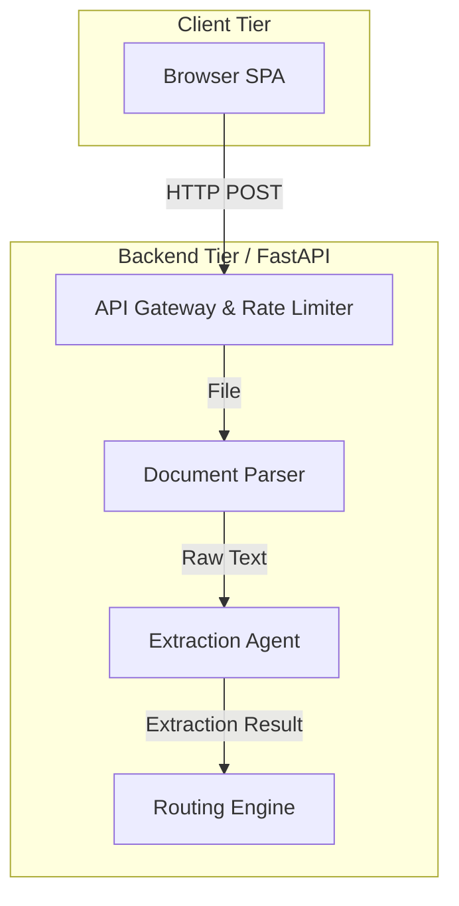
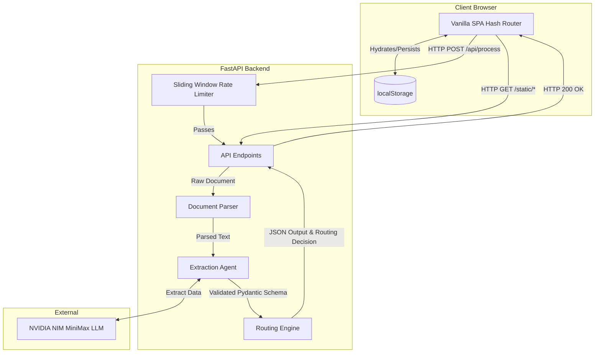
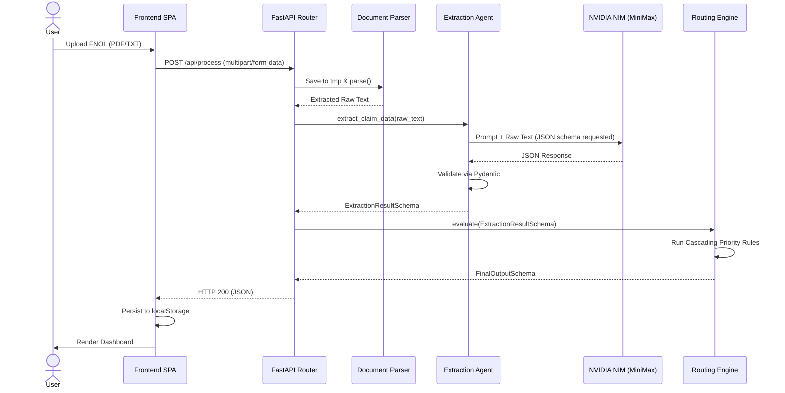
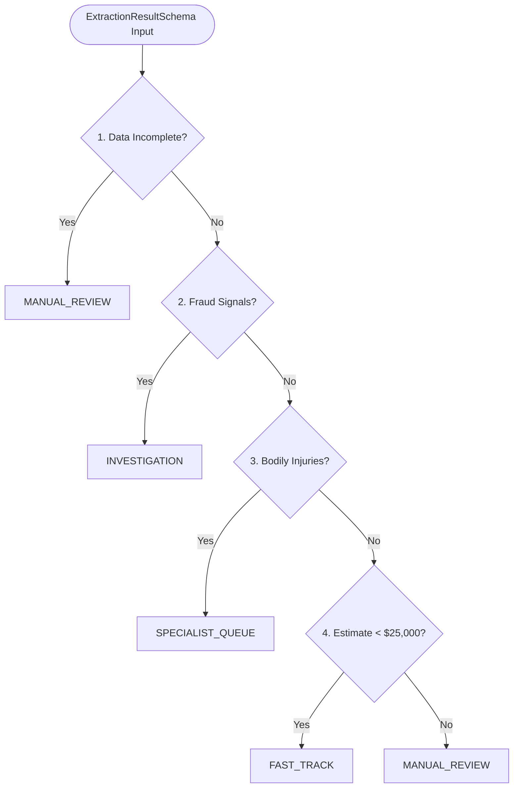

# Synpax — Technical Architecture & Documentation

Synpax is an AI-augmented claims processing platform that automates the lifecycle of a First Notice of Loss (FNOL) document. It uses a strict decoupling pattern: **probabilistic inference (AI) for data extraction** and **deterministic rules (pure code) for decision routing**.

> **⚠️ IMPORTANT: API Key Expiration**
> If you are testing the live demo or running this project locally and the document analysis fails, the free-tier NVIDIA NIM API key has likely expired or hit its limit. To run and test the application, please use your own NVIDIA API key. Check the [Deployment Guide](#5-deployment-guide) below for instructions on where to add it.

This document outlines the system architecture, component workflows, API specifications, and deployment protocols.

---

## 1. System Architecture

The system consists of a Vanilla SPA frontend (HTML/CSS/JS) communicating with a FastAPI backend. The backend manages rate limiting, document parsing, LLM extraction (via NVIDIA NIM), and rules-based routing.



### High-Level Component Diagram



---

## 2. API Documentation

### 2.1 Process Claim Document
**Endpoint:** `POST /api/process`  
**Rate Limit:** 5 requests / 60 seconds per IP

**Description:** Ingests a raw PDF or TXT file, extracts structural claim data using an LLM, evaluates business rules, and returns a routing decision.

**Request:**
- **Content-Type:** `multipart/form-data`
- **Body:** `file` (UploadFile, allowed extensions: `.pdf`, `.txt`)

**Responses:**
- `200 OK`: Successful processing and routing. Returns `FinalOutputSchema` in JSON.
- `400 Bad Request`: Unsupported file type.
- `429 Too Many Requests`: Rate limit exceeded.
- `500/502 Internal Server Error`: Processing or LLM inference failure.

**Example Response (200 OK):**
```json
{
  "claim_data": {
    "policyNumber": "POL12345",
    "incidentDate": "2023-10-15",
    "incidentDescription": "Rear-ended at a stop light.",
    "involvedParties": [],
    "initialEstimate": 5000.0,
    "missingMandatoryFields": []
  },
  "routing_decision": "FAST_TRACK",
  "reasoning": "Claim is complete, below $25,000 threshold, and involves no injuries or fraud indicators."
}
```

### 2.2 Serve Dashboard
**Endpoint:** `GET /`  
**Rate Limit:** 30 requests / 60 seconds per IP  
**Description:** Serves the main Single Page Application (`static/index.html`).

---

## 3. Core Processing Workflow

When a document hits `/api/process`, it undergoes a strict multi-step pipeline.



---

## 4. Engineering Deep-Dives

### 4.1 Routing Engine (Deterministic Priority Rules)
Insurance logic cannot rely on LLM hallucinations. The `RoutingEngine` ensures repeatable, auditable queue assignment using a hard-coded Python rule cascade. The first rule to match short-circuits the rest.



### 4.2 Sliding Window Rate Limiter
A custom ASGI middleware prevents boundary bursts common in fixed-window algorithms. It maintains a per-IP deque of UTC timestamps.
- **API Operations:** 5 requests per minute.
- **General (UI/Static):** 30 requests per minute.

### 4.3 Frontend Hash Router & Persistence
The SPA uses zero build tools.
- **Routing:** Listens to `window.location.hash` changes (e.g., `#/dashboard`, `#/queue/FAST_TRACK`) to dynamically re-render tables.
- **State:** Because there is no external database in this POC, claims are serialized and synced to browser `localStorage` (`synpax_claims`). This ensures state survives page refreshes and provides bookmarkable URLs.

---

## 5. Deployment Guide

### 5.1 Local Development Environment

1. **Clone & Virtual Environment:**
   ```bash
   git clone <repo-url>
   cd Synpax
   python3 -m venv venv
   source venv/bin/activate
   pip install -r requirements.txt
   ```

2. **Environment Variables:**
   Copy the example environment file and add your LLM API key.
   ```bash
   cp .env.example .env
   # Edit .env and set NVIDIA_API_KEY
   ```

3. **Start Development Server:**
   ```bash
   python app.py
   ```
   *Navigate to `http://localhost:8000`. Use documents in `static/samples/` to test.*

4. **Production Server Simulation:**
   ```bash
   gunicorn app:app --workers 2 --worker-class uvicorn.workers.UvicornWorker --timeout 120 --bind 0.0.0.0:8000
   ```

### 5.2 Production Deployment (Render)

Synpax ships with a `render.yaml` for infrastructure-as-code deployment on Render.

**Blueprint Deployment Steps:**
1. Push your repository to GitHub.
2. In the Render Dashboard, click **New** → **Blueprint** and connect your repository.
3. Render will parse `render.yaml` and provision a Web Service.
4. **Environment Variables:** Add `NVIDIA_API_KEY` directly in the Render dashboard's environment variables panel for the service.
5. Deploy.

**Manual Build & Start Commands (if not using blueprint):**
- **Build Command:** `pip install -r requirements.txt`
- **Start Command:** `gunicorn app:app --workers 2 --worker-class uvicorn.workers.UvicornWorker --timeout 120 --bind 0.0.0.0:$PORT`
